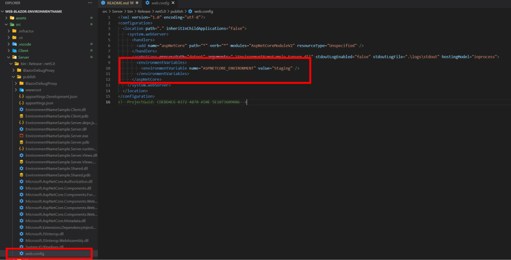

# Blazor WebAssembly project with Environment set at build time

Following on from by blog post, [Set ASPNETCORE_ENVIRONMENT in web.config using .NET Core CLI](https://adenearnshaw.com/set-environment-in-web-config/). Here's a sample Blazor WebAssembly app that can also take advantage of setting the EnvironmentName parameter at publish time.


## Setup

Create a new Blazor WebAssembly app using th `-ho` flag to indicate that the site will be hosted

```
 dotnet new blazorwasm -n EnvironmentNameSample -f net5.0 -ho
 ```

 This sets up a .Net 5 WebAssembly Solution with 3 projects, the Client, the Server and a Shared project.


## Publishing your hosted Blazor Wasm app

From the terminal, run the following command in the folder you're **.sln** file is in

```
 dotnet publish --configuration Release /p:EnvironmentName=Staging
```

Once this has completed, inspect the output of the **Server/bin/Release/net5.0/publish** folder. In here is the generated web.config which includes the `ASPNETCORE_ENVIRONMENT` value specified in the publish command.



## Further Information

- [Hosted deployment with ASP.NET Core](https://docs.microsoft.com/en-us/aspnet/core/blazor/host-and-deploy/webassembly?view=aspnetcore-5.0)
